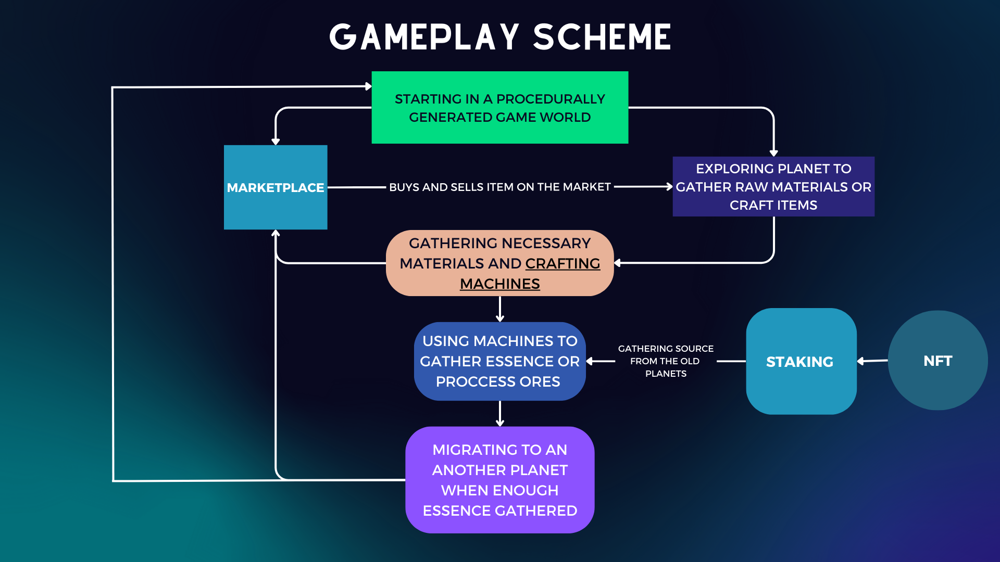

# :space_invader: Galacticore Game

Galacticore invites you into a captivating 2D RPG adventure set in a specially generated world, where survival and exploration intertwine with the revolutionary integration of ERC1155 tokens. Embark on an epic quest to discover valuable ores and essences while honing your crafting skills to forge powerful equipment. As you progress, upgrade your space ship and journey to unexplored planets, each brimming with its own treasures. Immerse yourself in this immersive experience where every item, resource, and achievement is represented as an ERC1155 token, bridging the gap between the virtual and real worlds.

Key Features:

- NFT is not required to play the game.
- Engage in a thrilling 2D RPG adventure in a meticulously generated world.
- Unearth rare and valuable ores and essences as you navigate the treacherous landscape.
- Master the art of crafting to create powerful equipment and tools.
- Experience the authenticity of ERC1155 tokens, representing every item and resource in the game.
- Upgrade your space ship and explore new planets teeming with untapped riches.
- Trade and own ERC1155 tokens beyond the game's universe, expanding your influence.
- Immerse yourself in a vast and ever-expanding universe, where each decision and accomplishment holds tangible value.

Join the immersive world of Galacticore and embark on a journey that transcends traditional gameplay, as you uncover the boundless possibilities and treasures that await with the integration of Shardeum Blockchain.

